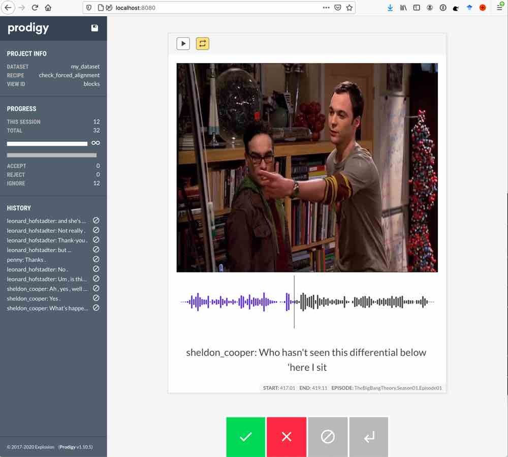

# plumcot-prodigy

Prodigy recipes for PLUMCOT dataset

## Installation


```bash
# clone this repository
$ git clone https://github.com/hbredin/plumcot-prodigy.git
$ cd plumcot-prodigy

# create and activate conda environment
$ conda env create -f environment.yml
$ conda activate plumcot-prodigy

# install prodigy 
$ (plumcot-prodigy) pip install prodigy.*.whl

# download spaCy english model
$ (plumcot-prodigy) python -m spacy download en_core_web_sm

# launch prodigy annotation server
$ (plumcot-prodigy) prodigy check_forced_alignment my_dataset -F plumcot_prodigy/recipes.py

Added dataset my_dataset to database SQLite.

✨  Starting the web server at http://localhost:8080 ...
Open the app in your browser and start annotating!

```




To access the server from anywhere, one can use [`ngrok`](https://ngrok.com/).
Once `ngrok` is copied and [running](https://dashboard.ngrok.com/get-started/setup) with `./ngrok http 8080`, you can access the web interface in your browser using the printed `http://xxxxx.ngrok.io` URL.

